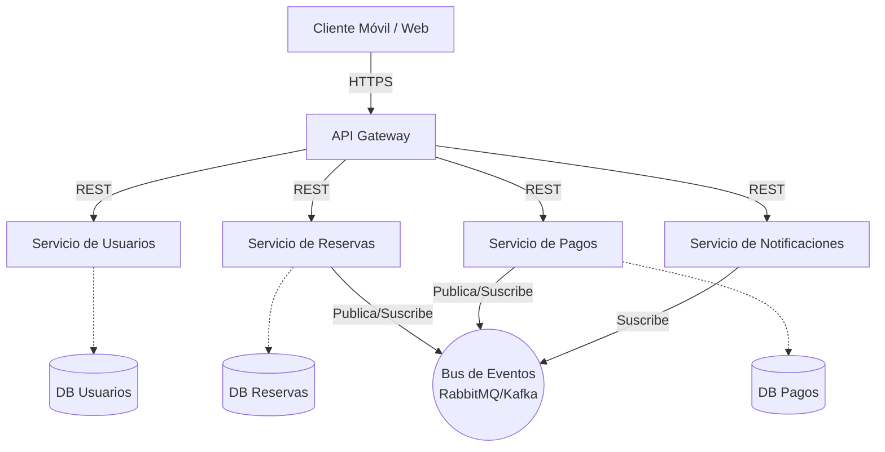

# Informe Técnico: Aplicación de Arquitectura Avanzada

## Datos Generales
- **Práctica:** 3 - Aplicación de arquitecturas avanzadas
- **Tema Seleccionado:** Arquitectura Orientada a Servicios (Microservicios)
- **Problema a resolver:** Sistema de Gestión de Canchas de un Polideportivo

---

## 1. Introducción
El presente informe técnico describe el diseño de una solución de software para el "Sistema de Gestión de Canchas de un Polideportivo". Con el objetivo de manejar adecuadamente la alta concurrencia de los usuarios y garantizar la disponibilidad del sistema, se ha seleccionado la aplicación de una **arquitectura orientada a servicios** (microservicios). Este documento detalla cómo este enfoque arquitectónico resuelve los problemas tradicionales de reservas superpuestas y cuellos de botella presentes en arquitecturas monolíticas.

## 2. Desarrollo (Descripción del problema)
El polideportivo ha incrementado su número de socios, y su sistema de reservas actual presenta fallas críticas, particularmente en los horarios pico (tardes y fines de semana). Las problemáticas principales son:
*   **Dobles reservas:** Debido a la alta concurrencia, varios usuarios pueden intentar reservar la misma cancha deportiva exactamente al mismo tiempo, ocasionando solapamientos de horarios.
*   **Caídas del sistema:** Durante eventos o torneos, el aumento repentino de tráfico provoca que todo el sistema monolítico deje de funcionar, impidiendo incluso el simple registro de nuevos usuarios.
*   **Baja mantenibilidad:** Integrar notificaciones por WhatsApp o nuevas pasarelas de pago resulta riesgoso, ya que un error en estos módulos puede afectar el núcleo de la aplicación (la agenda).

Se requiere una solución distribuida y escalable que separe las responsabilidades y garantice el rendimiento.

## 3. Diseño del Sistema

### Componentes del Sistema
La solución descompone la aplicación en los siguientes servicios independientes:
1.  **API Gateway:** Puerta de entrada única que gestiona las peticiones desde la aplicación móvil y el sitio web de los socios, balanceando la carga.
2.  **Servicio de Usuarios (Identity):** Administra el registro, autenticación (JWT), roles (socio, invitado, administrador) y membresías.
3.  **Servicio de Disponibilidad y Reservas:** Componente central que administra la agenda de las canchas, bloquea horarios temporalmente y evita solapamientos.
4.  **Servicio de Pagos:** Responsable de procesar transacciones financieras (suscripciones y alquiler de canchas) integrándose con pasarelas externas.
5.  **Servicio de Notificaciones:** Encargado de enviar correos electrónicos y mensajes de WhatsApp con confirmaciones y recordatorios.
6.  **Bus de Eventos (Message Broker):** Plataforma (ej. RabbitMQ o Apache Kafka) para la comunicación asíncrona entre los microservicios.

### Interacción entre Componentes
*   **Síncrona (REST/gRPC):** El *API Gateway* consulta directamente al *Servicio de Disponibilidad* para mostrar los horarios libres en tiempo real al usuario.
*   **Asíncrona (Basada en eventos):** Se utiliza para procesos que no requieren respuesta inmediata. Por ejemplo, al finalizar una reserva, el *Servicio de Reservas* publica el evento `ReservaCreada`. El *Servicio de Notificaciones* escucha este evento y procede a enviar el correo al usuario de forma independiente, sin demorar la respuesta de éxito en la pantalla del cliente.

### Flujo de Funcionamiento
1.  El usuario inicia sesión y consulta los horarios libres a través del *API Gateway*.
2.  Selecciona una cancha y horario. El *Servicio de Reservas* aplica un "bloqueo temporal" (ej. por 10 minutos) y cambia el estado a "Pendiente de Pago".
3.  El usuario procede a pagar mediante el *Servicio de Pagos*.
4.  Al aprobarse la transacción, el *Servicio de Pagos* emite el evento `PagoCompletado`.
5.  El *Servicio de Reservas* recibe el evento y consolida la reserva cambiando el estado a "Confirmada".
6.  Simultáneamente, el *Servicio de Notificaciones* detecta el evento y despacha el comprobante al cliente.

### Representación Arquitectónica

## 4. Justificación

### Por qué se eligió esta arquitectura
Se eligió la **Arquitectura Orientada a Servicios (Microservicios)** para desacoplar el dominio crítico (Reservas) de dominios secundarios (Notificaciones, Pagos). Esto permite escalar el *Servicio de Reservas* de manera independiente agregando más instancias durante los fines de semana (cuando la concurrencia es máxima), optimizando el uso de recursos del servidor.

### Beneficios de la solución
*   **Alta Disponibilidad:** Si el *Servicio de Notificaciones* experimenta una caída (ej. falla en el proveedor de correos), los usuarios pueden seguir reservando y pagando sus canchas sin interrupciones.
*   **Control de Concurrencia Robusto:** Al aislar la base de datos de reservas, se pueden aplicar bloqueos transaccionales más eficientes para evitar el solapamiento de horarios ("dobles reservas").
*   **Agilidad de Desarrollo:** Diferentes miembros del equipo pueden trabajar, probar y desplegar simultáneamente mejoras en el módulo de pagos o notificaciones sin requerir que se detenga todo el polideportivo.

## 5. Conclusiones
La implementación de una arquitectura orientada a servicios es la estrategia idónea para modernizar el sistema de gestión del polideportivo. Aunque requiere una orquestación inicial más compleja, solventa definitivamente los problemas de solapamiento de turnos, brinda tolerancia a fallos frente a caídas de servicios no críticos y prepara la plataforma tecnológica para escalar a medida que aumente el número de socios y canchas disponibles.

## 6. Referencias
*   Newman, S. (2021). *Building Microservices: Designing Fine-Grained Systems* (2da ed.). O'Reilly Media.
*   Pressman, R. S., & Maxim, B. R. (2020). *Software engineering: A practitioner's approach* (9na ed.). McGraw-Hill Education.
*   Richards, M., & Ford, N. (2020). *Fundamentals of Software Architecture: An Engineering Approach*. O'Reilly Media.
*   Sommerville, I. (2011). *Ingeniería de Software* (9na ed.). Pearson Educación.
